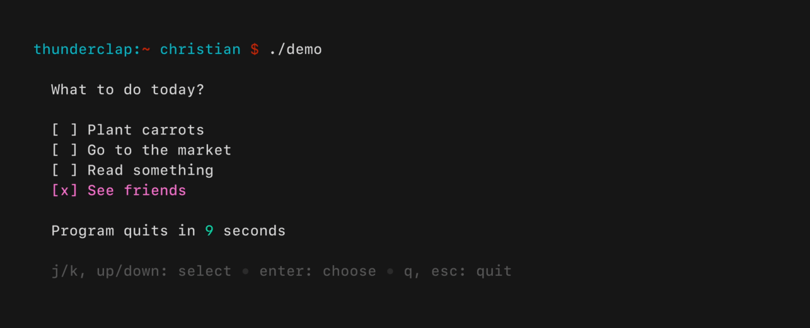

---
title: Bienvenidos a la CLI Week
author: Alexander Goussas
patat:
  incrementalLists: true
  margins:
    left: 20
    right: 20
  pandocExtensions:
    - emoji
  images:
    backend: auto
...

# ¿Qué es una herramienta de CLI?

Una herramienta diseñada para ser utilizada a través de una interfaz de texto.

Estas pueden categorizarse como:

- Intérpretes de línea de comando
  - grep
  - xclip
  - fd
  - jq
- TUIs
  - htop
  - ranger
  - fzf
  - spotify-tui

# Ejemplos de aplicaciones

Vamos a ver algunas aplicaciones para inspirarnos.

- youtube-dl
  - Descarga video de YouTube u otros sitios. 
  - Escrito en Python.
  - Ejemplo: `yt-dlp https://www.youtube.com/watch?v=Lngmx0v3aOs`
- httpie
  - Un cliente http para la terminal.
  - Escrito en Python.
  - Ejemplo: `http httpbin.org/status/418`
- ranger
  - Un file manager para la terminal.
  - Escrito en Python.
- fzf
  - Un fuzzy finder.
  - Escrito en Go.
  - Muy útil combinado con otras herramientas en scripts.
- patat
  - Presentaciones en la terminal.
  - Escrito en Haskell.
  - Usado para hacer esta presentación :).
- figlet
  - Arte ascii.
  - Escrito en C.
  - Ejemplo: `figlet "CLI Week <3"`
  - Ver también:
    - `toilet "CLI Week <3" --gay`
    - `toilet "CLI Week <3" | lolcat`

Y muchas más. https://github.com/agarrharr/awesome-cli-apps.

# Editores de texto

- vim
  - Editor de texto modal.
  - Escrito en C.
  - Configurado en VimL.
- nvim
  - Sucesor de vim.
  - Configurado en VimL o Lua.
- helix
  - Editor de texto modal.
  - Escrito en Rust.
  - Configurado en archivos toml.
- emacs
  - Configurado en un EmacsLisp.
  - Mucho más que un editor.
- micro
  - Sencillo.
  - Se tiene planeado implementar keybindings de Vim.
  - Escrito en Go.
  - Cuenta con un plugin manager builtin.

# Librerías

Ahora vamos a ver cómo podríamos hacer nuestra propia herramienta de CLI.

# Sin librería

- Secuencias de escape ANSI.
- Se pueden utilizar para controlar los atributos de la terminal.
- Ejemplo: `printf "CLI Week \033[31m<3\033[m\n"`
- El file manager fff está escrito en Bash únicamente utilizando estas
  secuencias de escape: https://github.com/dylanaraps/fff.
- Referencia: https://www2.ccs.neu.edu/research/gpc/VonaUtils/vona/terminal/vtansi.htm

# ncurses

- Librería para crear TUIs.
- Originalmente escrita en C, pero tiene bindings para muchos lenguajes.
- Ampliamente utilizada.
- Es de más bajo nivel que otras librerías o frameworks.

# Bubble Tea

- Un toolkit para crear aplicaciones de consola interactivas.
- Lenguaje de programación: Go.
- Github: https://github.com/charmbracelet/bubbletea.

#

# ¡Ahora te toca a ti!

Diviértete creando tu propia herramienta de CLI esta semana.

¡Estamos ansiosos por ver los resultados!
